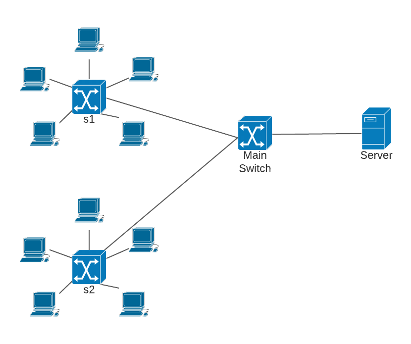

# qos-in-lan-networks

## Prerequisites

It is advisable to run Mininet on Ubuntu 18.04 virtual machine. To install all required software run:
```shell
make install
```
If you don't have make run:
```shell
sudo apt install make
```
## Usage

### Mininet

Mininet documentation: http://mininet.org/


Script `src/topology.py` creates a custom topology in *Mininet* environment. By default it is build as shown in the picture below:

<p align="center">
  
</p>

To run the topology with default parameters use the following command:
```shell
sudo python src/topology.py
```

Command line parameters:
- `--switches` - number of switches apart from the Main Switch, default `2`
- `--hosts` - number of hosts connected to each switch, default `1`
- `--file` - file that will be used for streaming, default `audio.mp3`
- `--duration` - streaming duration time in seconds, default `30s`

The output should be similar to the one below:
```shell
*** Creating network
*** Adding controller
*** Adding hosts:
h0 h1 h2
*** Adding switches:
s0 s1 s2
*** Adding links:
(10.00Mbit 1ms delay 5.00000% loss) (10.00Mbit 1ms delay 5.00000% loss) (h1, s1) (10.00Mbit 1ms delay 5.00000% loss) (10.00Mbit 1ms delay 5.00000% loss) (h2, s2) (s0, h0) (s0, s1) (s0, s2)
*** Configuring hosts
h0 (cfs -1/100000us) h1 (cfs -1/100000us) h2 (cfs -1/100000us)
*** Starting controller
c0 c
*** Starting 3 switches
s0 s1 s2 ...(10.00Mbit 1ms delay 5.00000% loss) (10.00Mbit 1ms delay 5.00000% loss)
*** Starting VLC server...
*** Starting VLC clients...
*** VLC server and clients started
*** Starting CLI:
mininet>

```

In Mininet CLI the following commands can be used:
- `xterm <host>` to start host console
- `nodes` to display network nodes
- `net` to display network links
- `h1 ping h2` to test connectivity between `h1` and `h2`
- `pingall` to test connectivity between all hosts
- `<host> <command>`, eg. `h1 ifconfig` to run command on specific host without using `xterm`
- `exit` to exit Mininet CLI

### VLC

#### On server: <br/><br/>
```shell
cvlc -vvv <path-to-file>.mp3 --sout "#standard{access=<access>,mux=<mux>,dst=<ip address>:<port>}" --run-time <time-in-seconds> vlc://quit
```
```shell
cvlc -vvv ../resources/audio.mp3 --sout "#standard{access=http,mux=ogg,dst=0.0.0.0:8080}" --run-time 40 vlc://quit
```

#### On client: <br/><br/>
`cvlc http://<ip address>:<port>`  

eg.: `cvlc http://10.0.0.254:8080`
