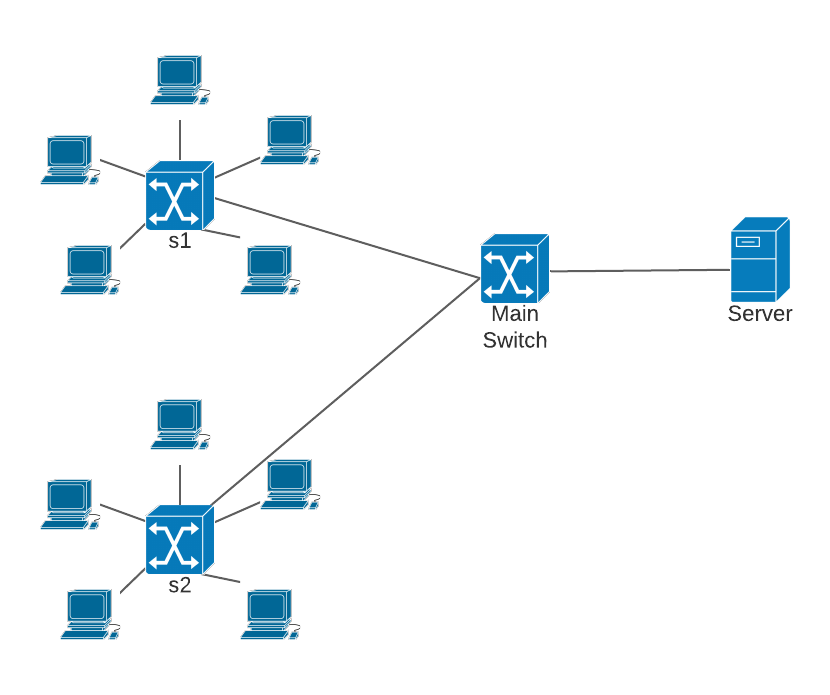

# qos-in-lan-networks
Mininet documentation: http://mininet.org/

To install Mininet locally run the following commands:
```
sudo apt-get install mininet -y
git clone git://github.com/mininet/mininet
mininet/util/install.sh -a
```

Script `topology.py` creates a custom topology in *Mininet* environment. By default it is build as shown in the picture below:


To run the topology with default parameters use the following command: <br/><br/>
`sudo python topology.py`

To customize the number of switches and hosts run: <br/><br/>
`sudo python topology.py --sw=5 --hosts=2`, <br/><br/>
where `--sw` means number of switches (apart from the Main Switch) and `--hosts` means the number of hosts connected to each switch. By default `--sw=2 --hosts=5`. Also, it is possible to modify link bandwidth, delay and loss.

The output should be similar to the one below:
```
*** Creating network
*** Adding controller
*** Adding hosts:
h0 h1 h2 h3 h4 h5 h6 h7 h8 h9 h10
*** Adding switches:
s0 s1 s2
*** Adding links:
(h1, s1) (h2, s1) (h3, s1) (h4, s1) (h5, s1) (h6, s2) (h7, s2) (h8, s2) (h9, s2) (h10, s2) (s0, h0) (s0, s1) (s0, s2)
*** Configuring hosts
h0 (cfs -1/100000us) h1 (cfs -1/100000us) h2 (cfs -1/100000us) h3 (cfs -1/100000us) h4 (cfs -1/100000us) h5 (cfs -1/100000us) h6 (cfs -1/100000us) h7 (cfs -1/100000us) h8 (cfs -1/100000us) h9 (cfs -1/100000us) h10 (cfs -1/100000us)
*** Starting controller
c0 c
*** Starting 3 switches
s0 s1 s2 ...
*** Ping: testing ping reachability
h0 -> h1 h2 h3 h4 h5 h6 h7 h8 h9 h10 nat0
h1 -> h0 h2 h3 h4 h5 h6 h7 h8 h9 h10 nat0
h2 -> h0 h1 h3 h4 h5 h6 h7 h8 h9 h10 nat0
h3 -> h0 h1 h2 h4 h5 h6 h7 h8 h9 h10 nat0
h4 -> h0 h1 h2 h3 h5 h6 h7 h8 h9 h10 nat0
h5 -> h0 h1 h2 h3 h4 h6 h7 h8 h9 h10 nat0
h6 -> h0 h1 h2 h3 h4 h5 h7 h8 h9 h10 nat0
h7 -> h0 h1 h2 h3 h4 h5 h6 h8 h9 h10 nat0
h8 -> h0 h1 h2 h3 h4 h5 h6 h7 h9 h10 nat0
h9 -> h0 h1 h2 h3 h4 h5 h6 h7 h8 h10 nat0
h10 -> h0 h1 h2 h3 h4 h5 h6 h7 h8 h9 nat0
nat0 -> h0 h1 h2 h3 h4 h5 h6 h7 h8 h9 h10
*** Results: 0% dropped (132/132 received)
*** Starting CLI:
mininet>

```

In Mininet CLI the following commands can be used:
- `xterm <host>` to start host console
- `nodes` to display network nodes
- `net` to display network links
- `h1 ping h2` to test connectivity between `h1` and `h2`
- `pingall` to test connectivity between all hosts
- `<host> <command>`, eg. `h1 ifconfig` to run command on specific host without using `xterm`
- `exit` to exit Mininet CLI
