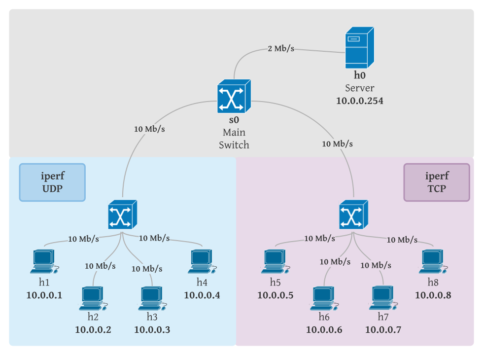

# qos-in-lan-networks

## Prerequisites

It is advisable to run Mininet on Ubuntu 18.04 virtual machine. To install all required software run:
```shell
make install
```
If you don't have make run:
```shell
sudo apt install make
```
## Usage

### Mininet

Mininet documentation: http://mininet.org/


Script `src/topology.py` creates a custom topology in *Mininet* environment. By default it is build as shown in the picture below:

<p align="center">
  
</p>

To run the topology with default parameters use the following command:
```shell
make run
```
or
```shell
python src/topology.py
```

Command line parameters:
- `--switches` - number of switches apart from the Main Switch, default `2`
- `--hosts` - number of hosts connected to each switch, default `1`
- `--queue` - used queue, default `fifo`
- `--duration` - streaming duration time in seconds, default `30s`


In Mininet CLI the following commands can be used:
- `xterm <host>` to start host console
- `nodes` to display network nodes
- `net` to display network links
- `h1 ping h2` to test connectivity between `h1` and `h2`
- `pingall` to test connectivity between all hosts
- `<host> <command>`, eg. `h1 ifconfig` to run command on specific host without using `xterm`
- `exit` to exit Mininet CLI
